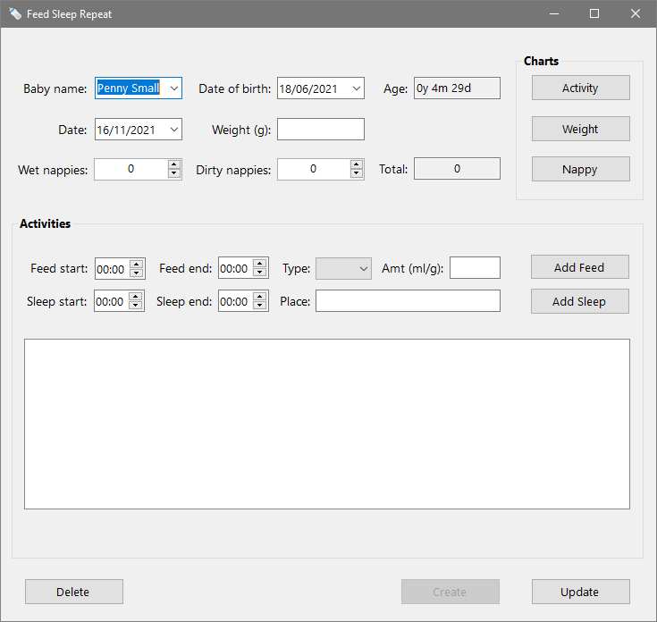
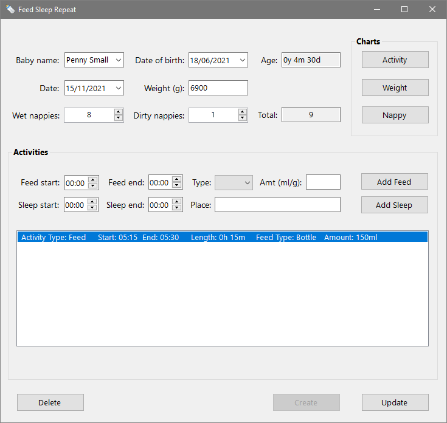
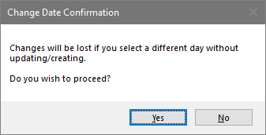

An app for tracking the daily activity of one or more babies.

Feed Sleep Repeat lets you record a baby's feeds, sleeps, nappies, and weight. 
You can then view charts that help you monitor progress and identify patterns of behaviour.

## Usage

Feed Sleep Repeat is a Windows desktop app written in C# that can be run via an executable file.
You need to have .Net 5 installed to use it.

## Instructions

Feed Sleep Repeat is intended to be simple to use.

There is one window for adding and viewing baby detailed baby information, and three others for viewing different charts.

The following sections give an overview of each screen.

### Main Screen

When you open Feed Sleep Repeat you'll be presented with the below screen:

As you can see, all the fields are either unpopulated or contain default values, and the buttons are greyed out.

#### Create

If you haven't used the app before, the first step is to create a baby record.

To do this, start by inserting the baby's first and last names into the *Baby name* field — 
they should be separated by a single space.
Then add the baby's date of birth in the *Date of birth* field.

You can now click the Create button to add the baby's record to the database.

#### Select

Once a baby has been added to Feed Sleep Repeat, you can click the *Baby name* field's dropdown arrow to select it.

The main screen's fields will then be populated with the selected baby's details.

#### Daily Numbers

The *Date* field defaults to today's date when you first select a baby, but you can change this to whichever date you 
you want to add information for.

The other fields in the top section are described below:

- *Age* is a readonly field showing the selected baby's age in years, months, and days.
- *Weight* is used to record the baby's weight in grams on the selected day. Note that the provided value must be a whole number.
- *Wet nappies* is a number picker field for keeping track of the daily number of wet nappy changes.
- *Dirty nappies* s a number picker field for keeping track of the daily number of dirty nappy changes.
- *Total* is a readonly field that displays the total number of nappy changes.

#### Activities

The activities section allows you to record start and end times of feeds and sleeps.

To record a feed, simply add the start time in the *Feed start* field and the end time in the *Feed end* field.

Select *Bottle*, *Breast*, or *Solid* from the *Type* dropdown. Then add the amount and click the *Add Feed* button.

You will see a summary of the details that hyou entered in the large list box below.

Sleep start and end times are added in the same way. And the location is recorded in the *Place* field before clicking the 
*Add Sleep* button.

If you need to delete feeds or sleeps, simply click on the activity in the list and press the *Delete* or *Backspace* key.

#### Update

Click the *Update* button to update the baby's record with the changes you have made to the selected day.

If you forget to do this and attempt to select another day, or baby, a warning message will appear. 
This gives you the opportunity to cancel the selection and update the baby's record before proceeding. 
An example of one theses messages can be seen below:

#### Delete

You can use the *Delete* button to permanently remove all the selected baby's information from the database.

This action cannot be reversed, so a delete confirmation will be shown giving you the opportunity to cancel if you wish.

#### Close

To close the application, simply click the window's *X* button. If changes will be lost, a message will  
be shown giving you the chance to cancel the action.