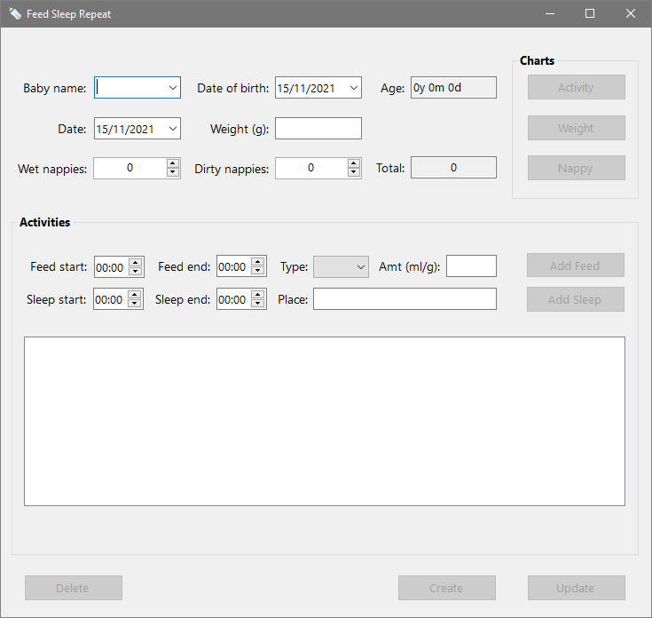
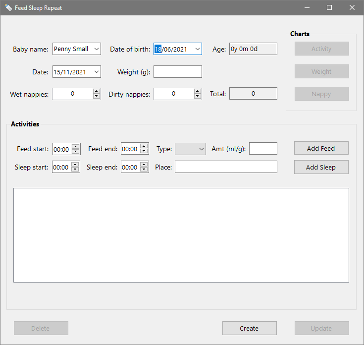

An app for tracking the daily activity of one or more babies.

Feed Sleep Repeat lets you record a baby's feeds, sleeps, nappies, and weight. 
You can then view charts that help you monitor progress and identify patterns of behaviour.

## Usage

Feed Sleep Repeat is a Windows desktop app written in C# that can be run via an executable file.
You need to have .Net 5 installed to use it.

## Instructions

Feed Sleep Repeat is intended to be simple to use.

There is one window for adding and viewing baby detailed baby information, and three others for viewing different charts.

The following sections give an overview of each screen.

### Main Screen

When you open Feed Sleep Repeat you'll be presented with the below screen:

As you can see, all the fields are either unpopulated or contain default values, and the buttons are greyed out.

#### Create

If you haven't used the app before, the first step is to create a baby record.

To do this, start by inserting the baby's first and last names into the *Baby name* field — 
they should be separated by a single space.
Then add the baby's date of birth in the *Date of birth* field.

You can now click the Create button to add the baby's record to the database.

