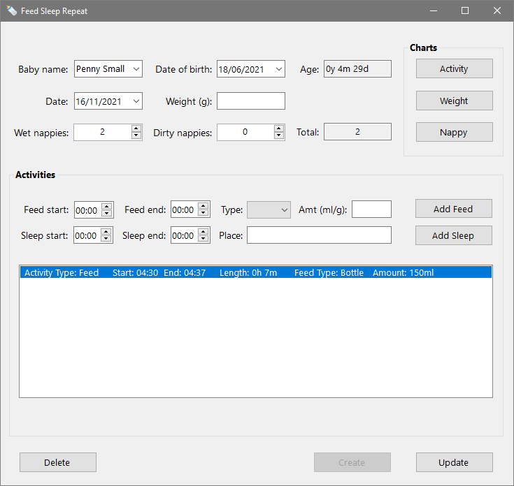
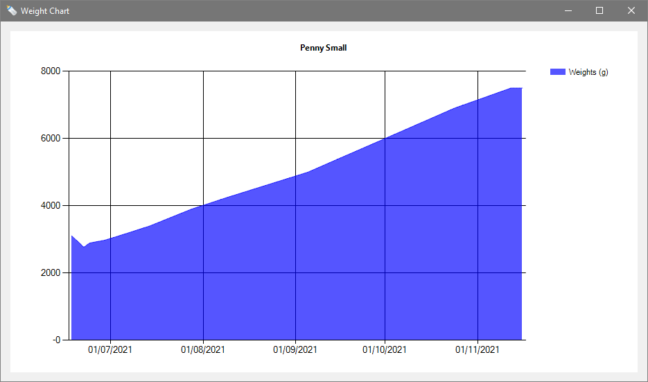
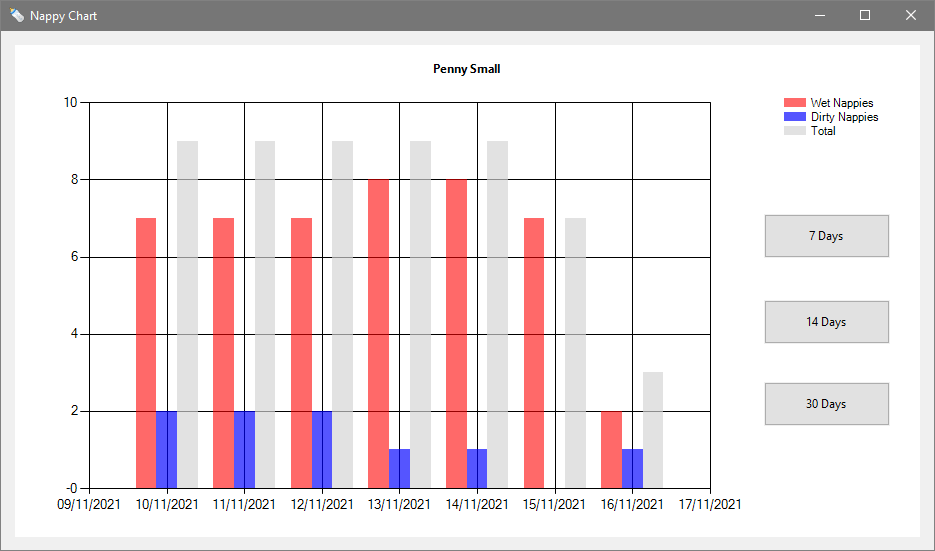

An app for tracking the daily activity of one or more babies.

Feed Sleep Repeat lets you record a baby's feeds, sleeps, nappy changes, and weight. 
You can then view charts that help you monitor progress and identify patterns of behaviour.

## Usage

Feed Sleep Repeat is a Windows desktop application written in C#. You can install it with 
[this file](https://feedsleeprepeat.azurewebsites.net/FeedSleepRepeatUI.application)
provided [.NET 5](https://dotnet.microsoft.com/download/dotnet/5.0) is already installed on your system.

The app isn't currently signed, so you are likely to receive warning messages 
on first launch.

Feed Sleep Repeat will check for an application update each time it's opened and, 
if one is found, you will be asked whether you want to download it.

## Instructions

Feed Sleep Repeat is intended to be simple to use.

There is one window for adding and viewing detailed baby information and three for viewing different charts.

The following sections give an overview of each screen.

### Main Screen

When you open Feed Sleep Repeat, you will be presented with the below window:

As you can see, all the fields are either unpopulated or contain default values, and the buttons are greyed out.

#### Create

If you haven't used the app before, the first step is to create a baby record.

To do this, start by inserting the baby's first and last names into the *Baby name* field, 
separated by a single space.
Then add the baby's date of birth to the *Date of birth* field.

You can now click the *Create* button to add the baby's record to the database.

Note that it's possible to create as many different baby records as you like.

#### Select

Once a baby has been added to Feed Sleep Repeat, you can click the *Baby name* field's dropdown arrow to select it.

The main screen's fields will then be populated with the selected baby's details.

#### Daily Numbers

The *Date* field defaults to today's date when you first select a baby, 
but you can change it if you want to add information about a different day.

The other fields in the top section are described below:

- *Age* is a read-only field showing the selected baby's age in years, months, and days.
- *Weight* is used to record the baby's weight on the selected day in grams. Note that the provided value must be a whole number.
- *Wet nappies* is a number picker field for keeping track of the daily number of wet nappy changes.
- *Dirty nappies* is for keeping track of of dirty nappy changes.
- *Total* is a read-only field that displays the total number of nappy changes.

#### Activities

The *Activities* section allows you to record the start and end times of feeds and sleeps.

To record a feed, simply add the start time in the *Feed start* field and the end time in the *Feed end* field.
Next, select *Bottle*, *Breast*, or *Solid* from the *Type* dropdown. Then add the amount in milliliters or grams 
and click the *Add Feed* button.

You'll see a summary of the details you entered in the large list box at the bottom of the section.

Sleep start and end times are added in the same way. And the location is recorded in the *Place* field before clicking the 
*Add Sleep* button.

Feed and sleep activities are automatically sorted in start time order. So, if you forget to add
an activity and enter it later, it will be slotted into the right place.

If you need to delete a feed or sleep, simply click on the activity in the list and press the *Delete* or *Backspace* key on your keyboard. 
(The application's *Delete* button has a different purpose, which is described at the end of this section.)

#### Update

Click the *Update* button to update the baby's record with the changes you have made to the selected day.

If you forget to do this and attempt to select another day (or baby) a warning message will appear. 
This gives you the opportunity to cancel the selection and update the baby's record before proceeding. 
An example of one of these messages can be seen below:

#### Delete

You can use the *Delete* button to permanently remove all the selected baby's information from the database.

This action is irreversible, so a delete confirmation will be shown, allowing you to cancel if you wish.

### Charts

Once you've added some data to Feed Sleep Repeat, you can look at visual representations of it to begin identifying patterns.

The three available chart types are activity, weight, and nappy. Each shows information about the selected baby and can be accessed 
via a dedicated button in the top right-hand corner of the main window.

#### Activity

Clicking the *Activity* button brings up a window that displays the past seven days of feed and sleep activity.

You can alter the chart's commencement date with the *Change date* field. 
So, for example, you can view the seven days prior to those initially shown 
by setting the commencement date a week earlier.

It’s also possible to compare two or more seven-day periods. To do this, return to the main window without closing the activity window. 
Then click the *Activity* button again and select a different commencement date.

#### Weight

The *Weight* button displays a chart showing the selected baby's weight in grams from birth to the current day.

#### Nappy

The final chart can be accessed by clicking the *Nappy* button. 
By default, it shows the number of wet and dirty nappy changes for each of the last seven days, along with daily totals.

However, you can also view the last 14 or 30 days of statistics by clicking the *14 Days* and *30 Days* buttons. 

If you want to return to the default view, you just need to click the *7 Days* button.

### Close

To close the main window or one of the charts, simply click the *X* button in the window's title bar. 
Closing the main window will automatically close any open chart windows. 
If closing the main window would result in the loss of changes, a message will be shown, 
giving you the chance to cancel the action.